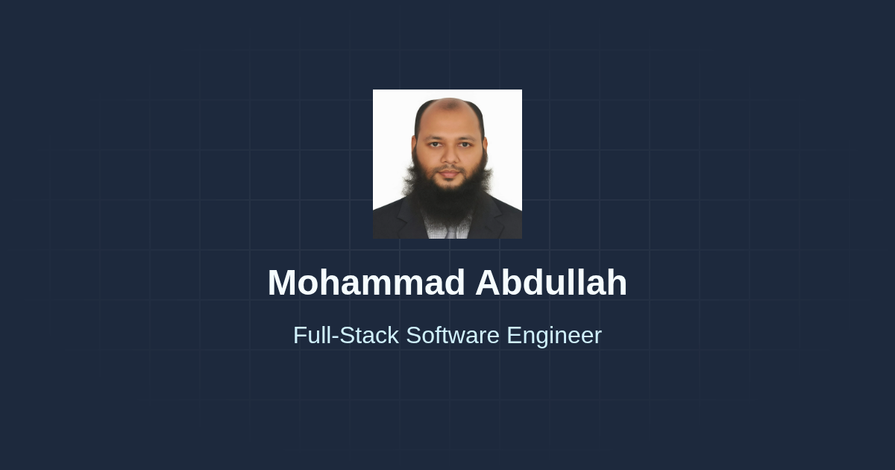

# 🌐 Mohammad Abdullah — Portfolio Website

A modern, responsive **personal portfolio** built with **HTML5**, **Tailwind CSS**, and **Lucide Icons** to showcase my experience, skills, and projects as a **Full-Stack Software Engineer**.

---

## 🚀 Overview

This portfolio highlights:

- Professional summary and work experience
- Technical skills and education
- Contact information and social links
- SEO optimization for better web visibility
- Fully responsive design for all devices

You can visit the live site here:  
👉 **[https://mohammad-abdullah-self.github.io/](https://mohammad-abdullah-self.github.io/)**

---
